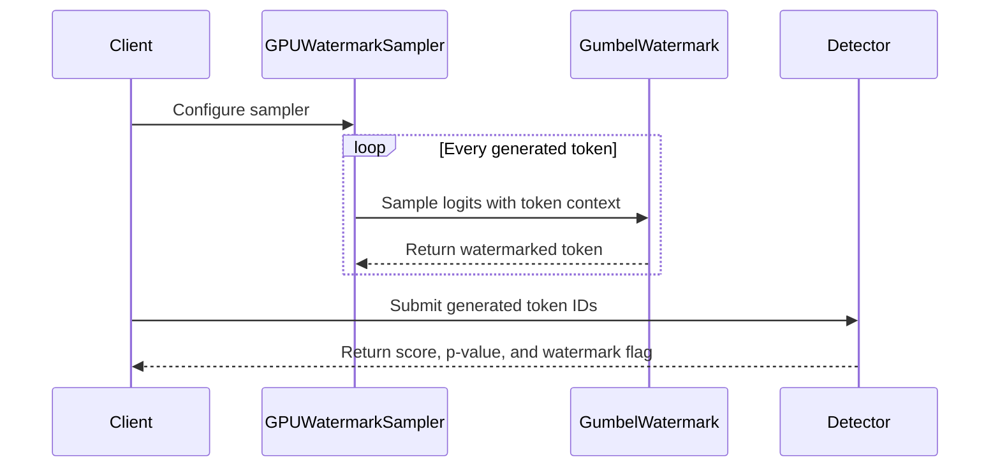

# Gibbous

GitHub, but with the UX you want.

## Features

- `🌔`/`🌘` global toggle for all of the tweaks
- Leaves GitHub untouched on mobile viewports
- 👀 button above files view: click to persistently hide files like CNAME in top-level repository views
- Hides unused buttons like Copilot and Workflows
- `forked in owner/repository` link to fork on upstream repositories when you have a fork
- On repositories you own, can push to, or have forked: no topics, resource links, social stats, Watch or Fork buttons, or sidebar extras; releases sit beside a tags panel, and contributors and languages become tabs next to `README`
- `My pull requests` tab on repositories where you have open pull requests, shown first; the license, conduct, contributing, and security tabs move into a `⋯` menu
- Enlarge Mermaid diagrams into a lightbox: scroll or double-click to zoom, drag to pan, Esc to close

### Try the Mermaid lightbox

With Gibbous on, use Enlarge on this diagram: scroll or double-click to zoom, drag to pan, press 0 to refit, and Esc to close.

## Install

1. Download and extract the ZIP.
2. Open `chrome://extensions`.
3. Enable **Developer mode**.
4. Click **Load unpacked** and select the extracted `gibbous-main` folder.

  

  <a href="https://www.flickr.com/photos/john-spade/6680460959/">Moon Waxing Gibbous January 2012</a>
  by <a href="https://www.flickr.com/photos/john-spade/">daspader</a>, licensed under
  <a href="https://creativecommons.org/licenses/by/2.0/">CC BY 2.0</a>.

