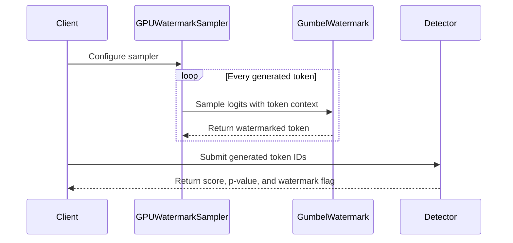

# Mermaid lightbox test

Use Enlarge to open the diagram, double-click to zoom, and drag to pan.

```mermaid
sequenceDiagram
    participant Client
    participant GPUWatermarkSampler
    participant GumbelWatermark
    participant Detector

    Client->>GPUWatermarkSampler: Configure sampler
    loop Every generated token
        GPUWatermarkSampler->>GumbelWatermark: Sample logits with token context
        GumbelWatermark-->>GPUWatermarkSampler: Return watermarked token
    end
    Client->>Detector: Submit generated token IDs
    Detector-->>Client: Return score, p-value, and watermark flag
```
